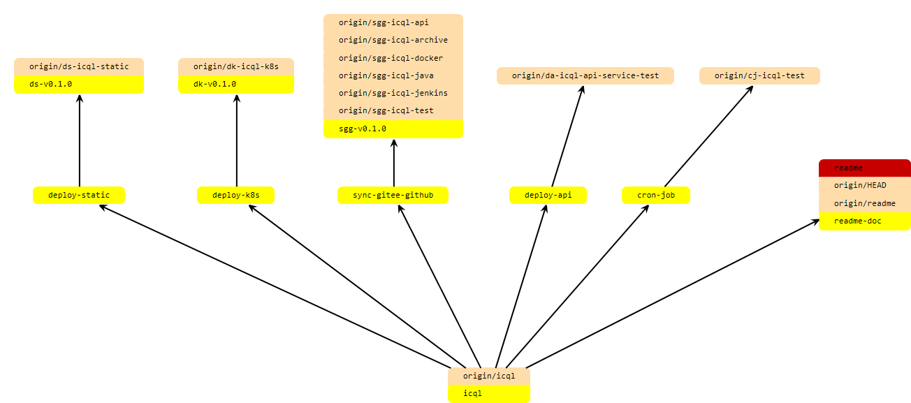

# icql-jenkins

jenkins pipeline（多分支流水线）

https://devops.jenkins.icql.work

readme文档分支，其余每条线均是单独的多分支流水线
``` bash
├──master
	├──readme（文档）
	├──sync-gitee-github（gitee-github仓库同步）
	├──deploy-k8s（k8s通用资源部署）
	├──deploy-static（k8s静态资源部署）
	├──deploy-api（api服务CI/CD，TODO）
    ├──cron-job（定时job，TODO）
```

revision-graph：
